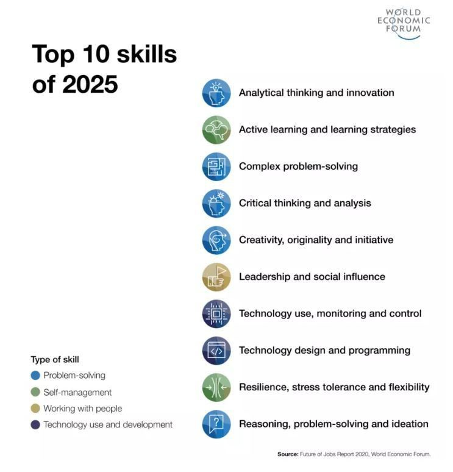

I read [this](https://senecalearning.com/en-GB/blog/top-10-most-effective-learning-strategies/) article and this inspired me to try to create an interactive course for myself using GitHub pages.

I copied part of the article here.

## 4. Elaborative interrogation

This strategy involves asking and answering Why and How questions. That is, thinking about a subject in more depth and detail, which strengthens connections in the brain.
## 3. Interleaved practice

Interleaving is the strategy of mixing up the order of questions across different topics. Research reveals this technique to be particularly effective in when teaching Maths and parts of the Science content. Commonly, students learn strategy A and solve a series of problems that demand strategy A, and then do the same with strategy B. Interleaving would be to learn strategy A and strategy B, and solve problems that can demand one or the other in a pseudo-random order. This way, students need to figure out the right strategy from the problem itself, which leads to a deeper understanding of the topic and better preparation for exams.
## 2. Distributed practice

Distributed practice is basically the opposite of cramming. Research consistently shows that studying small chunks of content spread out over time is more effective than studying long blocks of the same topic only once. To use it successfully, students should start preparing way ahead of their exam dates and organise their time with a calendar. In the classroom, teachers should review not only the previous lesson but also lessons from much earlier.
## 1. Practice testing

The most effective strategy according to Dunlosky’s research is practice testing. It consists of studying and reviewing by answering questions and actively bringing information back to mind. When this is done, information is reconsolidated, new connections are created, and memory and understanding are strengthened. When reviewing topics in class, teachers should always include low-stake quizzes. These can be of various types, as long as they demand active retrieval. Immediate feedback should be provided.

  
Tag test

  <b>aaaaa!!!</b>

[Word roots](roots.md)

[Time Management Fundamentals](time-management/what.md)

[Hard lessons in life](hard-lessons.md)

[How to improve self-esteem](self-esteem.md)
